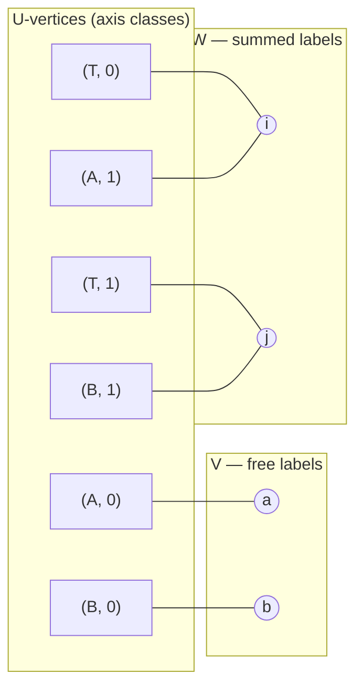
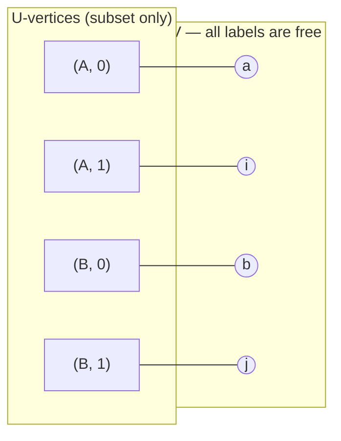
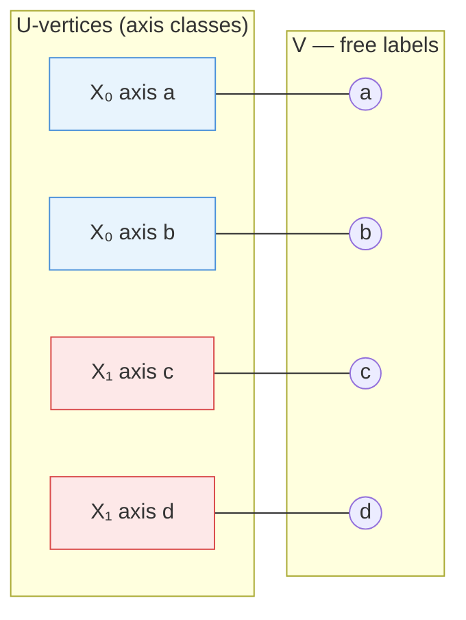
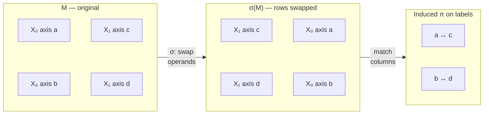

# Subgraph Symmetry Detection

A contributor-level walkthrough of the algorithm used to detect permutation
symmetry in einsum intermediates and propagate it through the contraction path.

## The problem

A multi-operand einsum like `'ij,ai,bj->ab'` is decomposed by opt_einsum into
a sequence of pairwise contractions. At each step the optimizer must evaluate
candidate pairs — and it needs to know, for each candidate intermediate, whether
the result is symmetric, so it can score it with a reduced cost.

When operands are `SymmetricTensor`s, their per-operand symmetry is known
upfront. But there is a second source of symmetry: when the same Python object
appears at multiple operand positions, the output can be symmetric in index
labels contributed by those repeated operands — even if the operands are dense.

The naive approach is to rerun a detection procedure at every step for every
candidate subset. This is too expensive for large contractions. We want:

1. **Correctness** — detect all exploitable symmetry without false positives.
2. **Memoization** — compute each intermediate's symmetry at most once.
3. **Laziness** — only evaluate subsets that the path optimizer actually visits.

Subgraph symmetry detection achieves all three.

## The bipartite graph

The core data structure is a bipartite graph over the einsum expression.

**Left vertices (U):** One U-vertex per equivalence class of axes within each
operand. For a dense operand with subscript `"ai"`, each axis is its own class,
producing two U-vertices. For a `SymmetricTensor` with subscript `"ij"` and
declared symmetry `S₂{i,j}`, both axes are in the same class, producing one
U-vertex.

**Right vertices (labels):** One right vertex per unique index label. Labels are
partitioned into:
- **V (free labels):** appear in the final output subscript or in operands
  outside the current subset (they "cross the cut").
- **W (summed labels):** contracted entirely within the current subset.

**Incidence:** An edge from U-vertex `u` to label `c` has weight equal to the
multiplicity of `c` in the axes belonging to class `u`.

**Identical-operand groups:** Operands that are the same Python object are
grouped. These groups are the source of induced symmetry.

### Worked example

Consider `'ij,ai,bj->ab'` with operands `T, A, B` where `T` is a dense tensor:

```
Subscripts:  ij,  ai,  bj  →  ab
Operands:    T    A    B
```

U-vertices (dense operands, one class per axis):

- `(T, 0)` — label set `{i}`
- `(T, 1)` — label set `{j}`
- `(A, 0)` — label set `{a}`
- `(A, 1)` — label set `{i}`
- `(B, 0)` — label set `{b}`
- `(B, 1)` — label set `{j}`

Free labels at the top level: `{a, b}` (appear in output `->ab`).
Summed labels at the top level: `{i, j}` (contracted out).

No identical operands in this example — `T`, `A`, and `B` are distinct Python
objects.

#### Full bipartite graph



Now consider the subset `{A, B}` (positions 1 and 2):

- U-vertices in subset: `(A, 0)`, `(A, 1)`, `(B, 0)`, `(B, 1)`
- Labels in subset: `{a, i, b, j}`
- Labels outside subset (in T): `{i, j}`
- Crossing labels (in subset AND in outside): `{i, j}`
- V at this step = `{a, b} ∪ {i, j}` = `{a, b, i, j}` (all four — `{i,j}` cross the cut)
- W at this step = `{}` (nothing is summed entirely within `{A, B}`)

#### Induced subgraph for subset {A, B}

When we restrict to subset {A, B}, labels `i` and `j` cross the cut (they also
appear in T, outside the subset), so they move from W to V:



The incidence matrix M at this subset (rows = U-vertices, columns = V∪W):

```
         a  i  b  j
(A, 0):  1  0  0  0
(A, 1):  0  1  0  0
(B, 0):  0  0  1  0
(B, 1):  0  0  0  1
```

## The subset-keyed oracle

The key invariant is the **pure-in-subset property**: the symmetry of an
intermediate tensor depends only on the set of original operands it was formed
from, not on the order in which they were contracted. This is because:

- The bipartite graph structure is fixed for the full einsum.
- The induced subgraph on a subset `S` is fully determined by which operands
  are in `S`.
- Symmetry is a property of the final intermediate, not its contraction history.

This property makes the subset key canonical. The oracle stores results in a
`dict[frozenset[int], SubsetSymmetry]` and returns cached results on
subsequent calls with the same subset.

```python
# One oracle per contract_path call
oracle = SubgraphSymmetryOracle(
    operands=list(operands),
    subscript_parts=input_parts,
    per_op_syms=index_symmetries,
    output_chars=output_str,
)

# Lazy evaluation — only computed on first access per subset
result = oracle.sym(frozenset({0, 1}))  # SubsetSymmetry for intermediate from ops 0 and 1
result.output  # V-side (output tensor) symmetry
result.inner   # W-side (inner summation) symmetry
```

## π-based detection

Given the induced subgraph M for a subset, detection proceeds in two passes:

### Fast path: fingerprint equivalences

For each label `c`, compute its column fingerprint `col(c)` — the tuple of
incidence values down the rows of M. Labels with identical fingerprints are
symmetry-equivalent. Group V-labels (and separately W-labels) by fingerprint;
any group of size ≥ 2 becomes a per-index symmetry group.

This catches symmetry arising from declared per-operand symmetry (e.g., a
`SymmetricTensor` where two axes collapse into one U-vertex, giving their
labels the same fingerprint) without needing to enumerate any operand
permutations.

### σ loop: derive π per operand permutation

For each permutation `σ` of the identical-operand groups:

1. Lift `σ` to a row permutation on M.
2. Compute `σ(M)`'s column fingerprints: `σ·col(c)` for each label `c`.
3. **Derive the induced label permutation π directly.** For each label `ℓ`,
   `π(ℓ)` is the label whose M-column matches `σ(M)`'s column for `ℓ` — a
   hash-table lookup in `O(1)`. When multiple labels share a fingerprint
   (collision), pick the lex-first unused candidate. If any label has no
   match, reject this σ.
4. **Validate π:** `π(V) ⊆ V` and `π(W) ⊆ W`. Any cycle crossing V↔W
   invalidates the σ.
5. **Classify π's cycle structure on V** (and separately on W):
   - Fixed points → no contribution.
   - Single k-cycle → per-index group on k labels.
   - Multiple disjoint cycles of the same length, from one σ → **block
     symmetry**. The number of cycles = block size; cycle length = number
     of blocks. Blocks are formed by grouping same-operand labels and
     ordering by subscript position.
   - Mixed-length cycles → independent per-index groups per cycle.

Results from the fast path and σ loop are merged via
`_merge_overlapping_groups`, which unions groups sharing labels and prefers
larger block sizes.

### Worked example: `einsum('ab,cd->abcd', X, X)`

Consider two identical dense matrices `X`. The bipartite graph has one
U-vertex per axis (four total), one label per column, and no W-labels
(nothing is contracted):



X₀ and X₁ are the same Python object (blue and red groups), forming one
identical-operand group of size 2.

The incidence matrix M is the 4×4 identity:

```
        a  b  c  d
u0_a  [ 1  0  0  0 ]
u0_b  [ 0  1  0  0 ]
u1_c  [ 0  0  1  0 ]
u1_d  [ 0  0  0  1 ]
```

**Fast path:** All four fingerprints are distinct — no equivalences.

**σ loop:** The only nontrivial σ swaps operands 0 and 1, permuting rows
(0↔2, 1↔3). The resulting σ(M) has columns:

```
σ(M)[:,a] = (0,0,1,0)  →  col_of[c]  →  π(a) = c
σ(M)[:,b] = (0,0,0,1)  →  col_of[d]  →  π(b) = d
σ(M)[:,c] = (1,0,0,0)  →  col_of[a]  →  π(c) = a
σ(M)[:,d] = (0,1,0,0)  →  col_of[b]  →  π(d) = b
```

The σ swaps the U-vertex groups, and π follows — each label maps to its
counterpart in the other operand:



So π = (a c)(b d). Two disjoint 2-cycles from one σ, all in V (W is empty).
Classify: number of cycles = 2 = block size; cycle length = 2 = number of
blocks. Group by operand: block₁ = (a, b), block₂ = (c, d). The result is
block S₂: `{(a,b), (c,d)}`.

### V-side and W-side

V-side groups are symmetries of the output tensor (same as before). W-side
groups are symmetries among the contracted (summed) labels — they describe
inner-summation redundancy that can optionally reduce FLOP estimates when
`use_inner_symmetry=True` is passed to `symmetric_flop_count`.

The oracle returns a `SubsetSymmetry` dataclass with `.output` (V-side) and
`.inner` (W-side) fields.

### Previous approach

The previous implementation used two separate code paths: Step 2a (Wilson's
pair-by-pair transposition test, O(|V|²) per σ) and Step 2b (hand-built
block-swap constructor for pairwise operand swaps). Both were special cases
of the π-based approach — Step 2a restricted π to single transpositions with
everything else fixed; Step 2b constructed a specific block π from subscript-
order positional pairing. The unified path subsumes both by deriving π
directly in O(|V|+|W|) per σ and classifying its full cycle structure.

## Complexity bound

The oracle evaluates each subset at most once. For a contract with `N` operands
and groups of sizes `k₁, k₂, …`:

- Number of subsets visited: at most `2^N` (usually much less — path algorithms
  visit only O(N²) subsets in practice for greedy and branch-bounded search).
- Per-subset cost: `O(m! · poly(n))` where `m = max(kᵢ)`.
- Total: `O(2^N · m! · poly(n))`, dominated by the path algorithm itself.

For the common case of a single pair of identical operands (`m = 2`):
per-subset cost is `O(poly(n))`.

## What we deleted and why

The previous implementation used three separate mechanisms:

1. `_detect_induced_output_symmetry` — a dense scan over operand pairs at the
   top level only, missing intermediates.
2. `propagate_symmetry` — a function that restricted per-operand groups through
   contraction steps, called eagerly at every step.
3. `induced_output_symmetry` kwarg on `contract_path` — passed the top-level
   detection result into the path algorithms.

**Problems with the old approach:**

- **Top-level only.** Detection ran once on the full operand list, not on
  intermediates. Symmetry detected at the top level was often consumed by the
  first contraction, giving zero savings on subsequent steps.
- **Over-eager propagation.** `propagate_symmetry` was called on every
  candidate pair during path search, with no caching. For large contractions
  this was O(N² · poly(n)) per step.
- **Silent drop.** When detection produced no result, the code silently fell
  back to dense costs with no diagnostic.

**What replaced it:**

- `SubgraphSymmetryOracle` — one object per `contract_path` call, subset-keyed,
  lazy, cached.
- `symmetry_oracle` kwarg on `contract_path` — plumbed through `_PATH_OPTIONS`
  so all algorithms receive it.
- `tests/test_no_silent_symmetry_drop.py` — enforces that the oracle is
  consumed and no silent fallback occurs.

The `induced_output_symmetry` kwarg, `propagate_symmetry`, and
`_detect_induced_output_symmetry` are all deleted. No replacement text is
needed — the oracle subsumes all three.

The oracle's internal detection algorithm was subsequently unified from two
separate code paths (Step 2a: Wilson's pair test, Step 2b: block-swap
constructor) into the single π-based approach described above.
