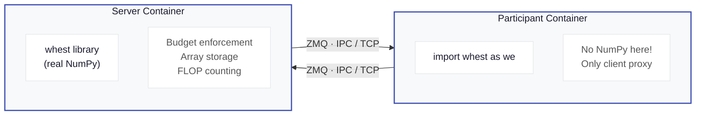

# Client-Server Model

## When to use this page

Use this page to understand how whest's client-server architecture works and why it exists.

## Why client-server?

In competition evaluation, participant code runs in an **isolated container** that cannot import NumPy directly. This prevents participants from bypassing FLOP counting by calling NumPy functions outside whest.

The client-server model enforces this isolation:



## How it works

1. **Server** runs the real whest library backed by NumPy. It stores all arrays, enforces budgets, and counts FLOPs.

2. **Client** is a drop-in replacement (`import whest as we`) that proxies every operation to the server over ZMQ (msgpack-encoded messages).

3. **Arrays stay on the server.** The client holds lightweight `RemoteArray` handles that reference server-side data. When you call `we.einsum(...)`, the client sends the operation and handle IDs to the server, which executes it and returns a new handle.

4. **Budget enforcement happens server-side.** The client cannot manipulate FLOP counts.

## Communication protocol

- **Transport:** ZMQ (REQ/REP pattern)
- **Serialization:** msgpack with binary-safe array payloads
- **Default endpoint:** `ipc:///tmp/whest.sock` (configurable via `WHEST_SERVER_URL`)
- **Timeout:** 30 seconds per request

## API compatibility

Code written for the local library works unchanged with the client:

```python
# This code works with BOTH the local library and the client
import whest as we

with we.BudgetContext(flop_budget=10**6) as budget:
    x = we.zeros((256,))
    W = we.random.randn(256, 256)
    h = we.einsum('ij,j->i', W, x)
    print(budget.summary())
```

## When to use which

| Use case | Package | Install path |
|----------|---------|-------------|
| Development, testing, research | `whest` (local library) | `uv add git+...` or `uv sync` from repo |
| Competition evaluation, sandboxed environments | `whest-client` + `whest-server` | Docker containers |

## Three packages in this repo

| Package | Location | Description |
|---------|----------|-------------|
| `whest` | `src/whest/` | Local library — full NumPy backend, direct execution |
| `whest-client` | `whest-client/` | Client proxy — no NumPy dependency, forwards ops to server |
| `whest-server` | `whest-server/` | Server — runs real whest, manages sessions and arrays |

## 📎 Related pages

- [Running with Docker](./docker.md) — set up client-server locally
- [Contributor Guide](../development/contributing.md) — source-checkout commands for local development
- [Your First Budget](../getting-started/first-budget.md) — getting started with the local library
